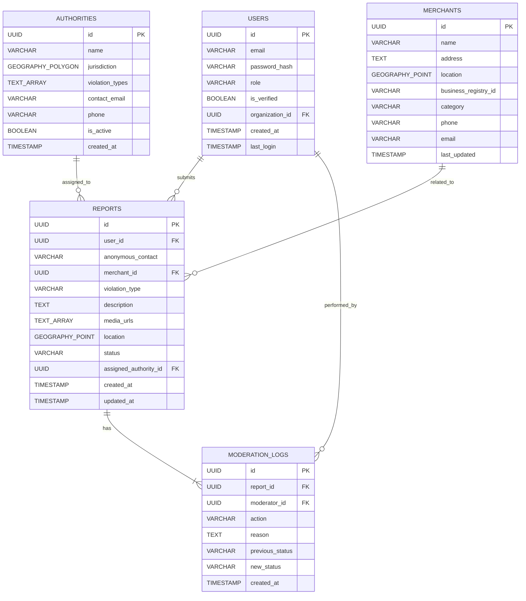

# Appendix: Data Model

This appendix provides the detailed SQL schema for the core entities of the Crowd-Powered Compliance Platform.

### Users

Supports anonymous reporting; registered users have roles (citizen, moderator, authority, admin).

```sql
CREATE TABLE "Users" (
  "id" UUID PRIMARY KEY DEFAULT gen_random_uuid(),
  "email" VARCHAR(255) UNIQUE,
  "password_hash" VARCHAR(255) NOT NULL,
  "role" VARCHAR(50) NOT NULL CHECK(role IN ('citizen', 'moderator', 'authority', 'admin')),
  "is_verified" BOOLEAN DEFAULT false,
  "organization_id" UUID REFERENCES "Authorities"("id"),
  "created_at" TIMESTAMP DEFAULT NOW(),
  "last_login" TIMESTAMP
);
```

### Reports

Links violations to merchants and locations; tracks status and assignment.

```sql
CREATE TABLE "Reports" (
  "id" UUID PRIMARY KEY DEFAULT gen_random_uuid(),
  "user_id" UUID REFERENCES "Users"("id"), -- NULL for anonymous reports
  "anonymous_contact" VARCHAR(255), -- Email/phone for anonymous users
  "merchant_id" UUID REFERENCES "Merchants"("id"),
  "violation_type" VARCHAR(100) NOT NULL,
  "description" TEXT NOT NULL,
  "media_urls" TEXT[], -- Array of photo/video URLs from S3
  "location" GEOGRAPHY(POINT, 4326) NOT NULL,
  "status" VARCHAR(50) DEFAULT 'submitted' CHECK(status IN ('submitted', 'under_review', 'verified', 'rejected', 'resolved')),
  "assigned_authority_id" UUID REFERENCES "Authorities"("id"),
  "created_at" TIMESTAMP DEFAULT NOW(),
  "updated_at" TIMESTAMP DEFAULT NOW()
);
```

### Authorities

Defines jurisdiction boundaries and handled violation types.

```sql
CREATE TABLE "Authorities" (
  "id" UUID PRIMARY KEY DEFAULT gen_random_uuid(),
  "name" VARCHAR(255) NOT NULL,
  "jurisdiction" GEOGRAPHY(POLYGON, 4326) NOT NULL,
  "violation_types" TEXT[] NOT NULL, -- e.g., ['packaging', 'pricing', 'health']
  "contact_email" VARCHAR(255) NOT NULL,
  "phone" VARCHAR(50),
  "is_active" BOOLEAN DEFAULT true,
  "created_at" TIMESTAMP DEFAULT NOW()
);
```

### Merchants

Contains business data with location for proximity matching.

```sql
CREATE TABLE "Merchants" (
  "id" UUID PRIMARY KEY DEFAULT gen_random_uuid(),
  "name" VARCHAR(255) NOT NULL,
  "address" TEXT,
  "location" GEOGRAPHY(POINT, 4326),
  "business_registry_id" VARCHAR(100) UNIQUE, -- External ID from business registry
  "category" VARCHAR(100), -- e.g., 'restaurant', 'retail', 'services'
  "phone" VARCHAR(50),
  "email" VARCHAR(255),
  "last_updated" TIMESTAMP DEFAULT NOW()
);
```

### ModerationLog

Tracks all moderation decisions and automated screening actions.

```sql
CREATE TABLE "ModerationLog" (
  "id" UUID PRIMARY KEY DEFAULT gen_random_uuid(),
  "report_id" UUID REFERENCES "Reports"("id") NOT NULL,
  "moderator_id" UUID REFERENCES "Users"("id"), -- NULL for automated screening
  "action" VARCHAR(50) NOT NULL CHECK(action IN ('auto_approve', 'auto_flag', 'manual_approve', 'manual_reject', 'manual_flag')),
  "reason" TEXT,
  "previous_status" VARCHAR(50),
  "new_status" VARCHAR(50),
  "created_at" TIMESTAMP DEFAULT NOW()
);
```

## Entity-Relationship Diagram


