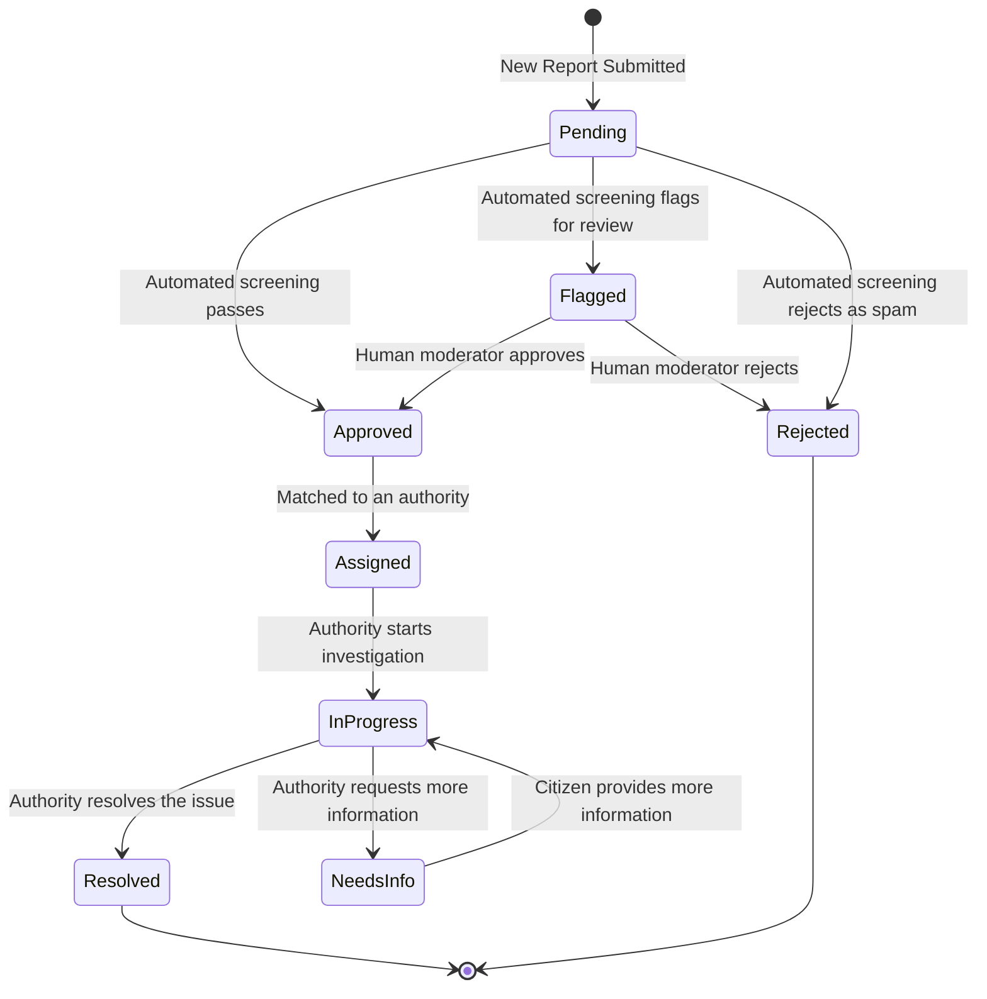

# Appendix: Report Lifecycle State Diagram

This diagram illustrates the various states a report can transition through, from submission to resolution, including automated screening and human moderation steps.

