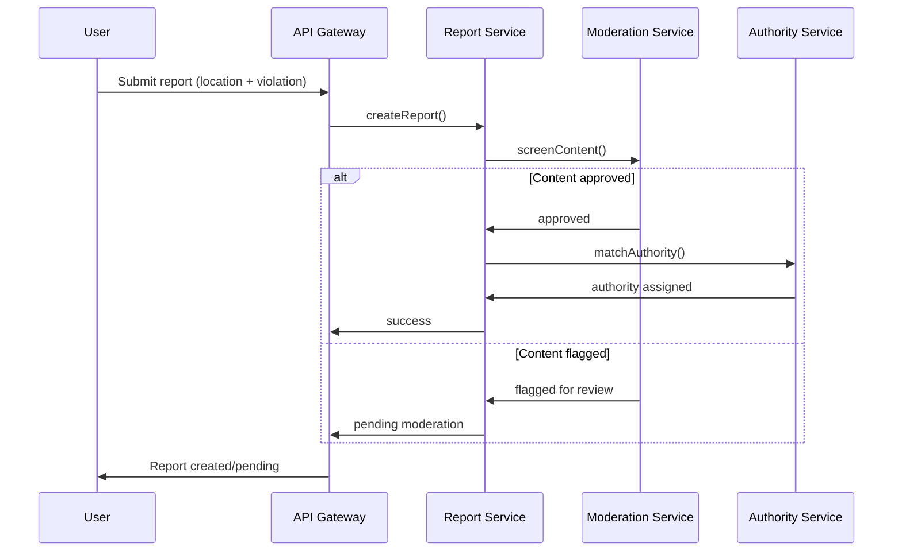

# Appendix: Report Submission Flow

This diagram illustrates the sequence of interactions involved when a user submits a report, detailing the flow from initial submission through content screening and authority assignment.

