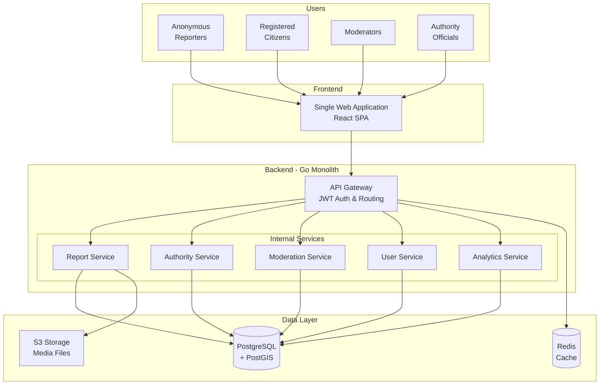

# Technical Brief: Crowd-Powered Compliance Platform

## Executive Summary & Problem

**The Challenge**: Public institutions struggle to monitor merchant compliance due to limited personnel, high task fragmentation, and tight budgets. Traditional inspection approaches are reactive and resource-intensive.

**Proposed Solution**: A crowd-powered platform enabling citizens to report compliance violations directly to appropriate authorities, with automated routing based on location and violation type. The system includes content moderation, authority dashboards, and analytics for improved oversight.

> For a detailed analysis of the civic challenges and how our product addresses them, see [Appendix: Product Empathy & Civic Challenges](../appendices/appendix-civic-empathy.md).

## System Architecture

### High-Level Architecture

### Core Components

**Frontend**: Single React application with role-based views and multi-language support (anonymous reporters, citizens, moderators, authority officials)

**Backend Services** (Go monolith with internal service boundaries):

- **Report Service**: CRUD operations, validation, media uploads
- **Authority Service**: Geospatial matching, jurisdiction management
- **Moderation Service**: Automated screening, quality control
- **User Service**: Authentication, role management
- **Analytics Service**: Dashboard data, compliance trends

### Technology Stack

| Component    | Technology           | Justification                                                       |
| ------------ | -------------------- | ------------------------------------------------------------------- |
| **Frontend** | React SPA            | Single codebase, role-based views, mobile-responsive                |
| **Backend**  | Go Monolith          | High performance, simple deployment, future microservice extraction |
| **Database** | PostgreSQL + PostGIS | ACID compliance, geospatial queries for authority matching          |
| **Cache**    | Redis                | Session management, performance optimization                        |
| **Storage**  | S3 Compatible        | Scalable media storage for photos/documents                         |
| **Auth**     | JWT                  | Stateless, secure, works across services                            |

## Critical System Design

### Data Model (Core Entities)

The data model revolves around five core entities: Users, Reports, Authorities, Merchants, and ModerationLogs. The design supports anonymous contributions, geospatial queries, and detailed tracking of all reports and moderation actions.

- **Users**: Manages roles (citizen, moderator, authority).
- **Reports**: Captures violation details, location, media, and status.
- **Authorities**: Defines jurisdictional boundaries and responsibilities.
- **Merchants**: Stores business information, linked to external registries.
- **ModerationLog**: Provides an audit trail for all content-related decisions.

> For the detailed SQL schema, see [Appendix: Data Model](../appendices/appendix-data-model.md).

### Authority Matching Logic

**Two-Factor Approach**:

1. **Geographic Matching**: PostGIS spatial queries match report location to authority jurisdiction polygons
2. **Violation Type Filtering**: Match report type to authority capabilities

**Fallback**: Route to regional coordinator if no exact match found

### Content Moderation Strategy

A hybrid strategy to ensure report quality before reaching authorities:

- **Automated Screening**: Initial filter for spam, profanity, and duplicates.
- **Human Review Queue**: For flagged or ambiguous reports.
- **Moderator Interface**: Provides context for informed decisions.
- **Audit Trail**: Logs all moderation actions for transparency.

> For details on the human moderation interface, see [Appendix: Human Moderation Interface](../appendices/appendix-moderation-interface.md).

### Report Submission Flow

The report submission flow outlines the sequence of interactions from a user submitting a report to its initial processing and routing within the system. This includes automated content screening and the assignment of reports to the relevant authorities.

> For a detailed diagram of the report submission flow, see [Appendix: Report Submission Flow](../appendices/appendix-report-submission-flow.md).

### Report Lifecycle

The report lifecycle defines the various states a report can transition through, from initial submission to final resolution or rejection. This includes automated screening, human moderation, and authority investigation steps. The diagram in the appendix illustrates the flow from a 'Pending' state, through 'Approved' or 'Flagged' (leading to human review), to 'Assigned' to an authority, and finally to 'Resolved' or 'Rejected'. It also covers scenarios where authorities might request more information from the citizen.

> For a detailed state diagram of the report lifecycle, see [Appendix: Report Lifecycle State Diagram](../appendices/appendix-report-lifecycle.md).

### Authority Dashboard & Insights

A secure, role-based dashboard for authority officials will feature:

- **Interactive Map View**: Real-time, color-coded map of reports within the authority's jurisdiction.
- **Report Management Queue**: Filterable and sortable list of all assigned reports for detailed review and status updates.
- **Basic Analytics**: Visualizations of report volume, types, and geographic hotspots.
- **Case History**: Access to historical data for trend analysis.

### Public Data Integration

To ensure data accuracy, the platform will use periodic batch jobs to integrate with external public data sources:

- **Merchant Data**: A weekly job will sync with business registry APIs to keep the merchant directory current.
- **Jurisdiction Data**: Geospatial boundary data will be imported from government portals quarterly to ensure correct report routing.

### Non-Functional Requirements

- **Security**:

  - **Authentication**: JWT with role-based access control.
  - **Data Transmission**: HTTPS/TLS for all communications.
  - **Data Integrity**: Input validation and SQL injection prevention.
  - **Anonymity**: Support for anonymous reporting with optional contact info.

- **Data Privacy (GDPR Compliance)**:

  - **Data Minimization**: Only necessary personal data is collected.
  - **User Consent**: Clear consent for data processing, with rights to access, rectify, and request deletion.
  - **Anonymization**: All data for public analytics will be fully anonymized.

- **Scalability & Performance**:

  - **Architecture**: Service-oriented monolith to enable future microservice extraction and horizontal scaling.
  - **Database**: PostgreSQL with spatial indexing for efficient geographic queries.
  - **Caching**: Redis for session management and performance optimization.
  - **API Response Times**: Core APIs to respond in < 200ms under normal load.
  - **Concurrent Users**: Target of 1,000 concurrent users.
  - **Report Ingestion**: Support for up to 100 reports per minute.

- **Accessibility & Internationalization**:
  - **Accessibility Standard**: Adherence to WCAG 2.1 AA standards.
  - **Multi-Language Support**: The user interface will be designed to support multiple languages from the outset.

## Risk Identification & Tradeoff Analysis

The platform's design balances competing priorities. Key tradeoffs include:

- **Architecture**: A monolith is used for initial speed, accepting future refactoring efforts.
- **User Anonymity**: Participation is prioritized by allowing anonymous reports, which requires a robust moderation system to ensure data quality.
- **External Data**: Reliance on external data sources for accuracy is managed with resilient, asynchronous integrations.
- **Moderation**: A centralized moderation team ensures initial control at the cost of future scalability.

> For a detailed analysis of each tradeoff, see [Appendix: Risk Identification & Tradeoff Analysis](../appendices/appendix-risks-and-tradeoffs.md).

## Implementation Context

- **Team**: The project will be led by a cross-functional team:
  - **Product Manager**: Owns the roadmap and stakeholder alignment.
  - **UX Designer**: Leads user research and designs the interfaces for all user roles.
  - **2 Full-Stack Developers**: Handle the end-to-end implementation.
  - **DevOps Support**: Manages infrastructure, CI/CD, and deployment.
- **Dependencies**: The project relies on access to external data sources, including a business registry API for merchant data and official government portals for geospatial jurisdiction data.

## Development Roadmap

The project will be delivered in phases. It begins with a crucial **pre-development phase** to ensure stakeholder alignment and technical feasibility before proceeding with the main development effort.

- **Phase 0: Pre-Development & Feasibility**: Secure pilot partners and validate external API dependencies.
- **Phase 1: MVP (6 Weeks)**: Following a successful go-ahead, deliver the foundational infrastructure, core reporting and matching logic, and the essential dashboards for authorities and moderators.
- **Phase 2: Advanced Dashboards & Notifications**: Enhance the authority dashboard with an interactive map and advanced analytics, and implement a robust notification system.
- **Phase 3: Community Reputation & Review**: Introduce a community reputation system and enable trusted community members to participate in the review process.
- **Phase 4: Advanced Intelligence**: Explore AI-driven insights for predictive compliance and resource allocation.

> For a detailed breakdown of timelines and milestones, see the complete [**Development Roadmap**](./02-roadmap.md).
